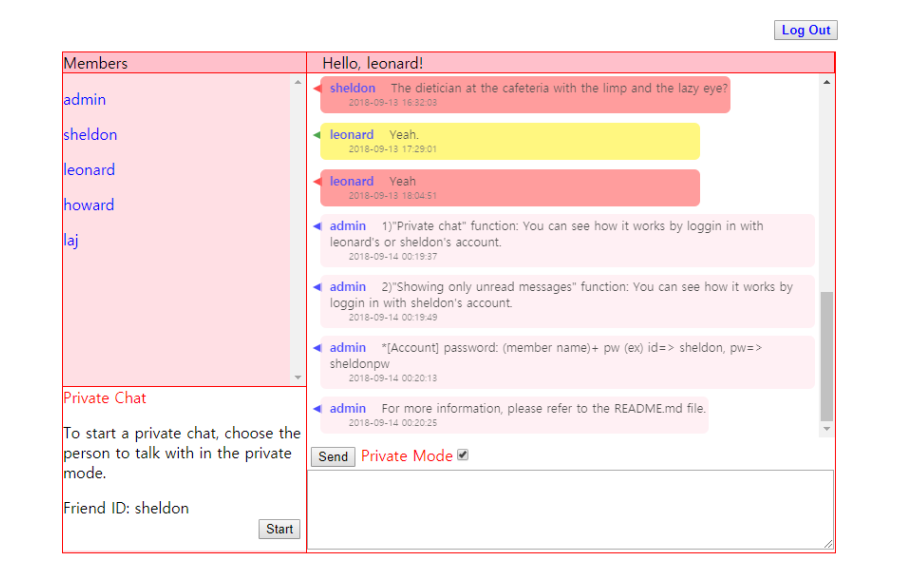

<h1 style=>PP02. Chatroom</h1>

	
     

	
<h4><i>This is a chatting application.</i></h4>
 
<h2>Techologies</h2>

HTML, CSS, JS, PHP, MySQL, API. 
  
<h2>Functionalities</h2>

<h3>1. Signup and Login/out </h3>
   - signup page
    "Data varification"
    Invalid data can't be submitted.  
    ex) Existing ID, email address without '@'.
     
   - log in page
    "Waring message"
    Case1) ID & Password aren't matched.
    Case2) ID doesn't exist.
      
   
<h3>2. Private mode Chatting</h3>
  A user can make his/her message visioble to only one person so that the user can talk  
  to that another user privately. 
   
  
  <b>How to chat in the private mode</b> 
  1. A user select another user to send a "private" message in the user list on the left side. 
  2. Check the "Private" check box and type the message to send.  
  3. Click "Send" button.  
   
  
<h3>3. Choosing to read only unread messages</h3> 
  A user can choose to read only the messages that the user hasn't read or not.     
   <b>Procedure:</b> 
  1) A user click "Log out" button.  
  2) The app asks if the user wants to read only the unread messages.  
  1) Click Yes/No in the question, if the user clickes "Yes", only unread messages'll show. 
    If not, all messages'll be displayed.  
    
 
<h2><i>Convinent way to see how this application works..</i></h2> 
 By importing the database("Back end/DB.sql") including the example dialogues & accounts 
 you'll be able to see how the app works more easily and faster.  
  
 After importing the DB, you can log in with any of these accounts.  
      <b>Accounts(ID & password)</b> 
   - admin   & adminpw    
   - sheldon & sheldonpw  
   - leonard & leonardpw  
   - howard  & howardpw   
   - laj     & lajpw     
     
   
<i>Convenient way to see how <b>"private mode chatting"</b> works?</i>
Use <b><i>"leonard"</i></b> or <b><i>"sheldon"</i></b> account. 
<i>Convenient way to see how <b>"Choosing to read only unread messages"</b>?</i>
Use <b><i>"sheldon"</i></b>account. 
      

PS. The used dialogue is the part of the script of the season 01 episode 03 of "The Big Bang Theory".
