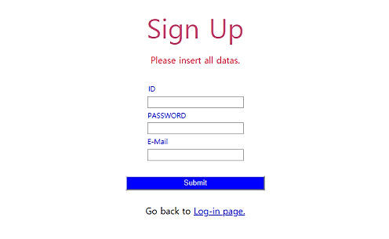
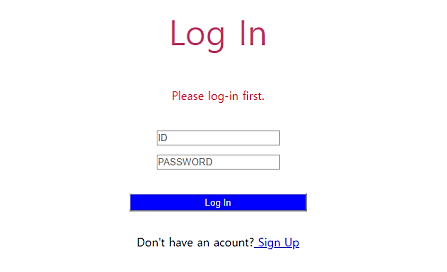

<h1 style=>PP02. Chatroom</h1>
 

     
    	

 

     

	

<h4><i>채팅 어플리케이션입니다.</i></h4>
 
<h2>사용 기술</h2>

HTML, CSS, JS, PHP, MySQL, SESSION, API, hashing.
  
<h2>기능 설명</h2>

<h3>1. 회원가입, 로그인/아웃 </h3>
   <b>회원가입</b>  
    "데이터 유효성 검사"  
    기존에 존재하는 ID 혹은 유효하지 않은 email 주소등, 유효하지 않은 데이터로 회원가입을 허용되지 않음.  
      
   <b>로그인 페이지</b>  
    "해당되는 로그인 실패 이유를 통보"  
    Case1) ID & 비밀번호가 일치하지 않음 
    Case2) ID가 존재하지 않음
      
   
<h3>2. Private mode 채팅</h3>
   User가 private mode로 대화할 경우, 본인과 receiver만 해당 대화 내용을 읽을 수 있습니다.  
   
  <b>과정 설명</b>  
  1. User가 private mode로 대화할 다른 유저를 채팅방 왼쪽의 User 리스트에서 선택합니다. 
  2. "Private" check box에 체크를 하고 보낼 메세지를 입력합니다. 
  3. "Send" 버튼을 클릭하여 메세지를 보냅니다.  
    
  
<h3>3. 메세지 구별하기</h3> 
    메세지의 전송자가 누구인가에 따라 메세지들이 구별되어 보여집니다.    
    - 본인의 메세지: "Yellow" box 
    - 타인의 메세지: "Pink" box 
    - "Private mode"로 보내진 메세지: "Red" box
     
  
<h3>4. 읽지 않은 메세지만 보기</h3>
 User가 로그아웃을 할때, app은 마지막으로 읽은 메세지에 대한 정보를 기록함으로써,     
 User는 다음 방문시, 새로운 메세지만을 볼 것인지를 선택할 수 있습니다.     
   <b>과정 설명:</b>  
  1) App을 나가기 위해, "Log out"버튼을 클릭합니다.  
  2) App은 오직 "새로운" 메세지만 읽을 것인지를 묻습니다.  
  1) User가 "Yes"를 클릭하면 새로운 메세지들만 보여지고,  
    아닌 경우는 모든 메세지가 보여집니다. 
    
 
<h2><i>App을 실행하신 경우, 기능들을 확인하기 위한 보다 편리한 방법들..</i></h2> 
 Demo를 위한 예시 the example dialogues 와 accounts가 "Back end/DB.sql"에 저장되어 있습니다. 
 이 데이타베이스 파일을 import하시면 여러명의 accounts를 생성할 필요없이 app의 기능들을 살펴보실수 있습니다. 
   
      <b>Accounts(ID & password)</b> 
   - admin   & adminpw    
   - sheldon & sheldonpw  
   - leonard & leonardpw  
   - howard  & howardpw   
   - laj     & lajpw     
     
   
<i><b>"private mode chatting"</b>기능을 살펴보시기 위해서는  <b>leonard</b> 또는 <b>sheldon</b>의 account를 이용하세요. 
<b>"Choosing to read only unread messages"</b>기능을 살펴보시기 위해서는  <b>sheldon</b>의 account를 이용하세요. </i>
   

PS. 예시 dialogue는 "The Big Bang Theory"의 시즌1 에피스드3의 스크립트의 일부입니다.

----------------------------------------------------------------------------------------------------------------------------------------
  

<h4><i>This is a chatting application.</i></h4>
 
<h2>Techologies</h2>

HTML, CSS, JS, PHP, MySQL, API, hashing
  
<h2>Functionalities</h2>

<h3>1. Signup and Login/out </h3>
    <b>Sign up</b>  
    "Data varification"  
    Invalid data can't be submitted.   
    ex) Existing ID, email address without '@'.
      
   <b>Log in</b>  
    "Waring message"  
    Case1) ID & Password aren't matched. 
    Case2) ID doesn't exist. 
     
   
<h3>2. Private mode Chatting</h3>
  A user can make his/her message visioble to only one person so that the user can talk  
  to that another user privately. 
   
  
  <b>How to chat in the private mode</b> 
  1. A user select another user to send a "private" message in the user list on the left side. 
  2. Check the "Private" check box and type the message to send.  
  3. Click "Send" button.  
   
  
<h3>3. Differentiating messages</h3>
    According to who is the receiver of each message, messages are displayed differently.   
    - The user's message: "Yellow" box 
    - Other's messages: "Pink" box 
    - Messages written in the private mode: "Red" box
    
  
<h3>4. Choosing to read only unread messages</h3>
  When a user logs out, the app restore the data about the last message.  
  So, the user can choose to read only the messages that the user hasn't read or not.     
   <b>Procedure:</b>  
  1) A user click "Log out" button.  
  2) The app asks if the user wants to read only the unread messages.  
  1) Click Yes/No in the question, if the user clickes "Yes", only unread messages'll show. 
    If not, all messages'll be displayed.  
    
 
<h2><i>Convinent way to see how this application works..</i></h2> 
 By importing the database("Back end/DB.sql") including the example dialogues & accounts 
 you won't need to create many accounts to see how the app works. 
  
 After importing the DB, you can log in with any of these accounts.  
      <b>Accounts(ID & password)</b> 
   - admin   & adminpw    
   - sheldon & sheldonpw  
   - leonard & leonardpw  
   - howard  & howardpw   
   - laj     & lajpw     
     
   
<i>Convenient way to see how <b>"private mode chatting"</b> works?  Use <b>leonard</b>'s or <b>sheldon</b>'s account. 
Convenient way to see how <b>"Choosing to read only unread messages"</b> works?  Use <b>sheldon</b>'s account.</i>
   

PS. The used dialogue is a part of the script of the season 01 episode 03 of "The Big Bang Theory".
